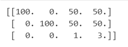
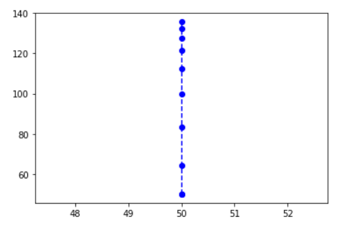
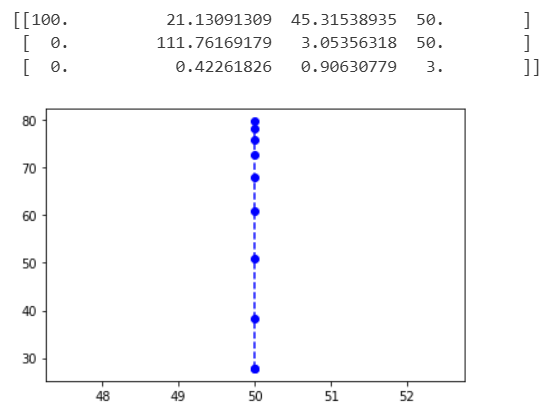

# 3D Computer Vision
Assignments and solutions for the Fundamental 3D Computer Vision (CE-344) course at Sharif University of Technology
The description of each assignment will be completed...

* ## HW1 - Signal & Image Processing

    This assignment contains four questions, each focusing on different image processing tasks such as:
    > * DFT
    > * Fourier transform implementation
    > * Image smoothing
    > * Color space conversion, and noise removal

    - **2D-DFT using np.fft.fft2**:
         

    - **Fourier transform implementation from scratch**:
        

    - **Smoothing**:
        

    - **HSV and YCbCr**:
        

    - **Removing salt and pepper noises**:
        

* ## HW2 - 3D Geometry

    This assignment contains four parts:
    > * Implementing camera matrix and camera projection
    > * Obtaining camera matrix for a particular example
    > * Applying the camera matrix to a vector
    > * Changing R and T 

    - **You can see an example of camera matrix**
        

    - **This is the result of the projection done in the notebook**:
        

    - **And here, we have done 2 sequential rotations**:
        

## Instructor ✍
[Professor Shohreh Kasaei](https://scholar.google.com/citations?user=mvx4PvgAAAAJ&hl=en)
