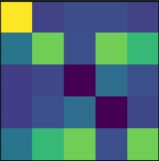

# 3D-Computer-Vision
Assignments and solutions for the Fundamental 3D Computer Vision (CE-344) course at Sharif University of Technology
The description of each assignment will be completed...

# HW1

This assignment contains four questions, each focusing on different image processing tasks such as DFT, Fourier transform implementation, image smoothing, color space conversion, and noise removal. Below is a detailed explanation of each question along with the expected results.

---

## Question 1: 2D DFT and Manual Fourier Transform

### Description
This question is divided into two parts:
1. **2D DFT:** The goal is to compute the 2D Discrete Fourier Transform (DFT) of an image and visualize the magnitude of the Fourier spectrum using a built-in function.
2. **Manual Fourier Transform:** In this part, the Fourier Transform is implemented manually without using ready-made functions such as `np.fft.fft` or `cv2.dft`. The objective is to understand the mechanics of Fourier Transform at a deeper level.

### Steps
- **2D DFT:**
  - Apply the 2D DFT on an input matrix using `np.fft.fft2`.
  - Visualize the magnitude of the Fourier spectrum (shifted for visualization).

  
- **Manual Fourier Transform:**
  - Implement the Fourier Transform manually by computing it pixel-by-pixel using the mathematical definition.
  - Compare the results of the manual implementation with the built-in `np.fft.fft2` function.

### Related Images

<!-- This image shows the 2D Fourier Transform spectrum. -->

<!-- This image shows the result of the manual Fourier Transform. -->

---

## Question 2: Image Smoothing with Various Filters

### Description
In this question, you are required to apply different smoothing techniques to an image. Various filters such as average (mean), Gaussian, and median filters are used to smooth the image and reduce noise.

### Steps
- **Mean Filter:**
  - Apply a mean filter to smooth the image by averaging the pixel values in a local neighborhood.
  
- **Gaussian Filter:**
  - Apply a Gaussian filter to the image, where the pixel values are weighted based on a Gaussian distribution.
  
- **Median Filter:**
  - Use a median filter to remove noise by replacing each pixel with the median value from its local neighborhood.

### Related Images

<!-- This image shows the image smoothed using the mean filter. -->

<!-- This image shows the image smoothed using the Gaussian filter. -->

<!-- This image shows the image smoothed using the median filter. -->

---

## Question 3: HSV and YCbCr Color Space Conversion

### Description
The aim of this question is to convert an image from the RGB color space to two different color spaces:
1. **HSV (Hue, Saturation, Value):** A cylindrical color model that separates color information (hue) from intensity (value).
2. **YCbCr:** A color space that separates luma (brightness) from chroma (color information).

### Steps
- **HSV Conversion:**
  - Convert the RGB image to HSV using OpenCV's `cv2.cvtColor` function.
  
- **YCbCr Conversion:**
  - Convert the RGB image to YCbCr format using OpenCV.
  
- **Visualization:**
  - Display the individual channels of both the HSV and YCbCr color spaces.

### Related Images

<!-- This image shows the HSV converted image. -->

<!-- This image shows the YCbCr converted image. -->

---

## Question 4: Salt-and-Pepper Noise Removal

### Description
In this question, the task is to remove salt-and-pepper noise (impulse noise) from a corrupted image. A median filter is the most effective method to eliminate this type of noise, as it preserves edges while removing noise.

### Steps
- **Salt-and-Pepper Noise Addition:**
  - First, add salt-and-pepper noise to an image by randomly replacing pixel values with either 0 (black) or 255 (white).
  
- **Noise Removal:**
  - Apply a median filter to the noisy image to remove the noise while preserving the edges.

### Related Images

<!-- This image shows the image corrupted with salt-and-pepper noise. -->

<!-- This image shows the result after removing salt-and-pepper noise using a median filter. -->

---
