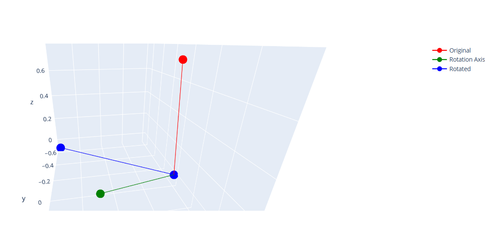

# 3D Computer Vision
Assignments and solutions for the Fundamental 3D Computer Vision (CE-344) course at **Sharif University of Technology**
The description of each assignment will be completed...

* ## HW1 - Signal & Image Processing

    This assignment contains four questions, each focusing on different image processing tasks such as:
    > * DFT
    > * Fourier transform implementation
    > * Image smoothing
    > * Color space conversion, and noise removal

    - **2D-DFT using np.fft.fft2**:
         

    - **Fourier transform implementation from scratch**:
        

    - **Smoothing**:
        

    - **HSV and YCbCr**:
        

    - **Removing salt and pepper noises**:
        

* ## HW2 - 3D Geometry

    This assignment contains four parts:
    > * Implementing camera matrix and camera projection
    > * Obtaining camera matrix for a particular example
    > * Applying the camera matrix to a vector
    > * Changing R and T 

    - **You can see an example of camera matrix**:

        

    - **This is the result of the projection done in the notebook**:

        

    - **And here, we have done 2 sequential rotations**:

        

* ## HW3 - Cameras and Projections

    This assignment contains three parts:
    > * Understanding Rotations in-depth!
    > * Estimating Camera Pose from 2D-3D correspondences
    > * Image Mosaicing

    - **Understanding Rotations in-depth!**:
        In this question, we want to visualize some rotations in 3D Space. we will get to understand what are quaternions, and rotation matrices. We will also see how to convert between these representations.

        Rotation Visualization of Quaternion:
        

    - **Estimating Camera Pose from 2D-3D correspondences**:
        In this question, you are given a set of 2D-3D correspondences. You are also given the intrinsic parameters of the camera. You need to estimate the pose of the camera (R & T) in the world coordinate system.

        Camera Pose and 3D to 2D Projection:
        

    - **Image Mosaicing**:
        The task of image mosaicing is something we use everyday to create panoramas. In this question, we want to create a panorama from a set of images. We will use the homography matrix to do so.

        
        
        

        
        
 
      **The final result**:
      
        

* ## HW4 - 3D Reconstruction from 2 Views

    This assignment contains two parts:
    > * Implementing the eight-point algorithm.
    > * Implementing the normalized eight-point algorithm.

    Input images:

    
    

    Result:

    

## Instructor ✍
[Professor Shohreh Kasaei](https://scholar.google.com/citations?user=mvx4PvgAAAAJ&hl=en)
